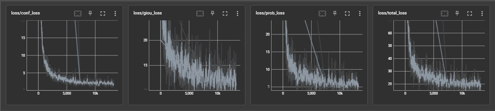
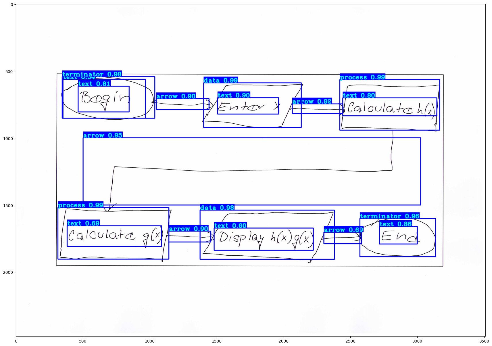

[Proposal](https://docs.google.com/document/d/1min_aHQF5sf6_ieqOGGpwV4Use2VStQybVCBv5W3MO8/edit?usp=sharing)

# Hand-drawn Flowchart Recognition
## Team Members:
- Mu Chen, MS-SE (mu.chen@sjsu.edu) [SJSU ID: 014725425]
- Roger Kuo, MS-SE (roger.kuo@sjsu.edu) [SJSU ID: 013784706]
- Hardy Leung, MS-AI (kwok-shing.leung@sjsu.edu) [SJSU ID: 016711877] COORDINATOR
- Jasmine Wang, MS-AI (jasmine.wang@sjsu.edu) [SJSU ID: 002805362]
---
## Abstract
We propose to develop a method to recognize hand-drawn flowcharts to be used in software applications including word processors and presentation softwares. While many softwares provide functionality to recreate flowcharts using functionalities such as drawing circles, blocks, and arrows, they are often primitive and awkward to use. Anecdotal evidence suggests that many people avoid flowcharts due to such difficulty, despite the fact that flowcharts can often help succinctly summarize important concepts such as workflow and relationships. Our goal is to develop a DNN-based model that can take an image of a flowchart, and extract the blocks, text, arrows, and their relative positioning. Thereafter, the flowchart can be recreated in graphical applications.

## Coding and Training
Our approach will be based on either YOLO (v4 and above) or Faster R-CNN with fine-tuning on important flowchart elements such as blocks, circles, diamonds, arrows, and lines. Text elements will also be extracted and copied as-is (and extended to OCR in a future project). The main challenges of the project are: (1) acquiring dataset for training, (2) increasing the accuracy of the object detection, and (3) increasing the accuracy of the semantics we extract from the detected objects. We envision that the project entails a 4-stage process: (a) a preprocessing stage to cleanup the image based primarily on OpenCV, (b) an object detection stage using DNN such as a fine-tuned YOLO on our training dataset, and potentially specialized DNNs to classify elements such as lines beyond what YOLO can do, (c) an analysis stage that reconstruct the semantics of the flowchart, and (d) an assembly stage to save and recreate the flowchart in other formats suitable for further processing. We will provide an end-to-end demo of the whole process on real-world flowcharts.

If possible, we will build our training datasets from existing resources if available, including datasets of individual elements that allow us to classify individual flowchart elements, as well as complete flowchart for testing purposes. If needed, we will also manually create necessary training data to improve the performance.

## Software
Python 3, OpenCV 2, Pytorch 2.0, Matplotlib, YOLO (v4 or above) or Faster R-CNN.

Dataset preparation doc: https://docs.google.com/document/d/1iY2F0LpL9rOEVAxZMaGc8gkD9l-GDl9_IjW8bnVCrqw/edit?usp=sharing

---
## Model Evaluation

Enter in the terminal ```tensorboard --logdir=log``` and then navigate to http://localhost:6006/
### Training Loss


### Validation Loss


### Sample Classification

